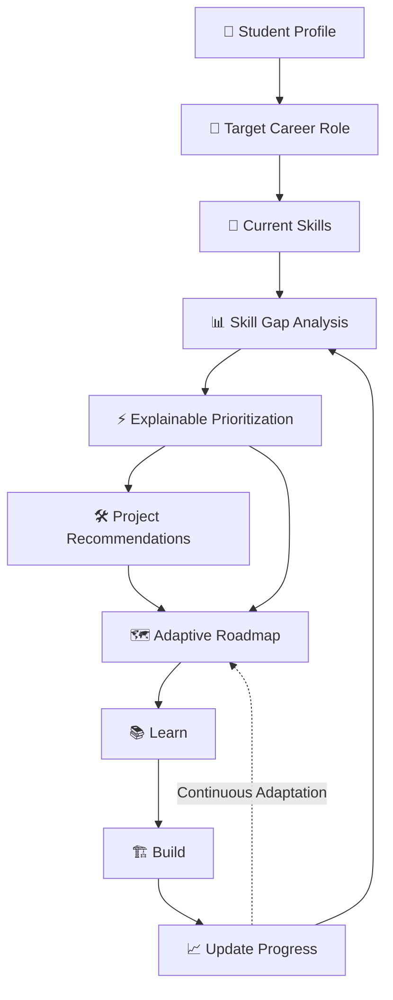
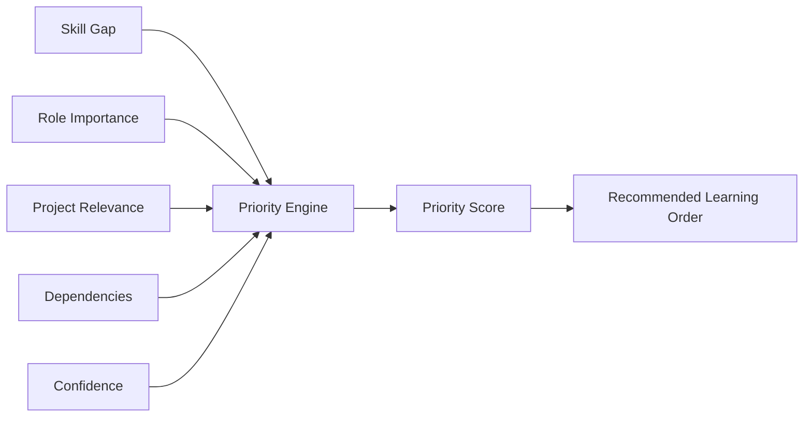
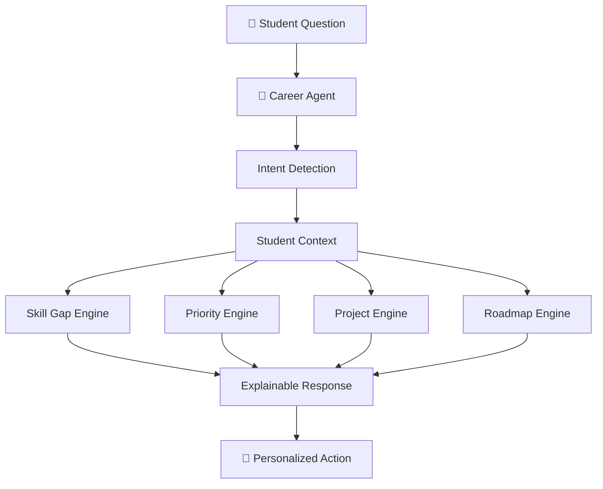
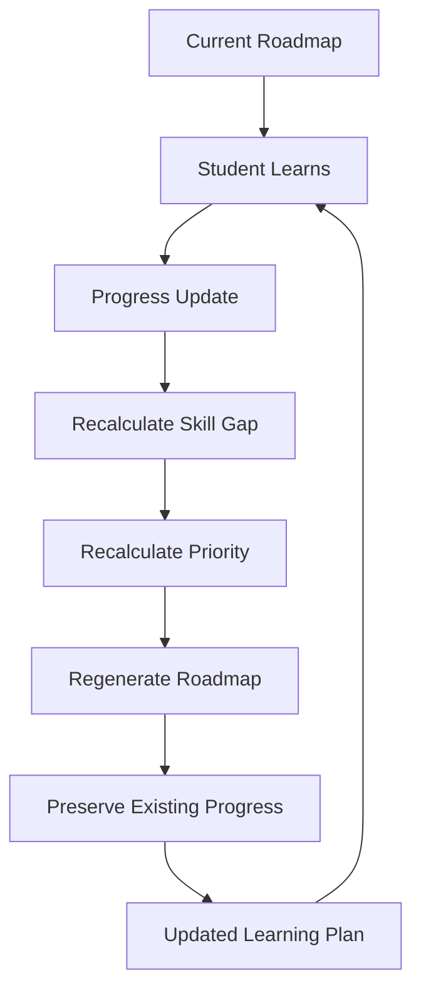
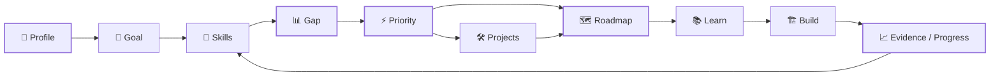
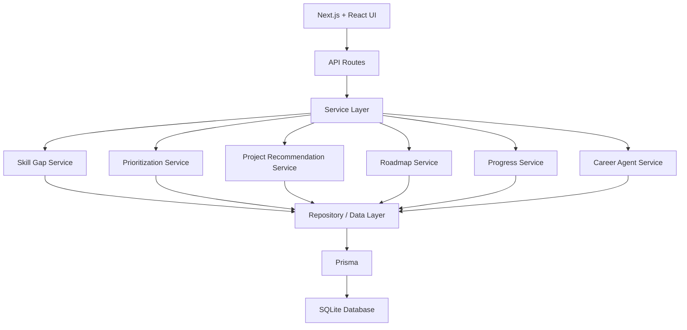
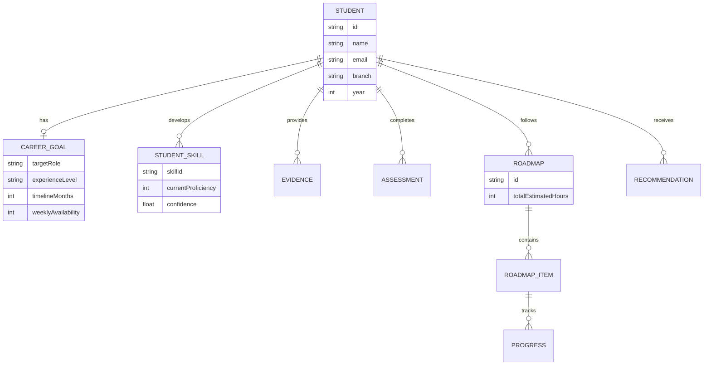
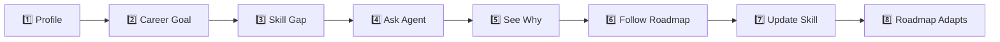

# GAPLY 🚀

### AI Career Agent for Skill-Gap Analysis, Personalized Learning & Adaptive Roadmaps

> **Know your gap. Build what matters. Move forward with clarity.**

GAPLY is an **AI-powered career-readiness platform** built for students who know the role they want but don't know **what skills they are missing, what to learn first, what projects to build, or how their roadmap should change as they improve.**

Instead of giving every student the same learning path, GAPLY continuously analyzes:

* 🎯 Target career role
* 🧠 Current skill proficiency
* 📊 Role-specific skill requirements
* ⚡ Skill gaps and priorities
* 🛠️ Project relevance
* ⏱️ Weekly learning availability
* 📈 Learning progress

and converts them into an **explainable, personalized and adaptive career roadmap**.

---

## 🏆 Hackathon Problem

Students often know:

> **"I want to become a Full Stack Developer."**

But they don't know:

* What skills are actually required?
* Which skills are they missing?
* Which skill should they learn first?
* Why is one skill more important than another?
* Which projects prove those skills?
* How much time should they spend each week?
* What should change when their proficiency improves?

### GAPLY answers these questions in one continuous system.

---

# 💡 Our Solution

GAPLY acts as an **AI Career Agent** that transforms a student's current state into a measurable action plan.



### The Core Loop

**Assess → Analyze → Prioritize → Learn → Build → Re-assess → Adapt**

This makes GAPLY more than a static career dashboard — it is designed as a **continuous career guidance loop**.

---

# ✨ Key Features

## 🎯 1. Career Goal Engine

Students define their career direction through:

* Target role
* Experience level
* Timeline
* Weekly learning availability
* Preferred technologies

The career goal becomes the foundation for every downstream recommendation.

---

## 🧠 2. Skill-Gap Analysis

GAPLY compares:

**Current Proficiency vs Required Proficiency**

For every skill, the system provides:

| Metric               | Meaning                                 |
| -------------------- | --------------------------------------- |
| Current Proficiency  | Student's current estimated level       |
| Required Proficiency | Level required for the target role      |
| Skill Gap            | Difference between current and required |
| Severity             | LOW / MEDIUM / HIGH                     |
| Confidence           | Confidence in the assessment            |
| Explanation          | Why the gap exists                      |
| Readiness            | Overall role readiness                  |

### Example

```text
System Design

Current:   62
Required:  65
Gap:       -3

Status: LOW
```

---

# ⚡ 3. Explainable Skill Prioritization

Not every missing skill deserves equal attention.

GAPLY calculates a priority using multiple factors:



The prioritization considers:

* **Gap size — 30%**
* **Role importance — 25%**
* **Project relevance — 20%**
* **Dependency score — 15%**
* **Confidence — 10%**

This allows GAPLY to explain:

> **"Why should I learn this skill now?"**

instead of simply showing a list of missing skills.

---

# 🤖 4. AI Career Agent

The **AI Career Agent** is the central interaction layer of GAPLY.

Students can ask questions such as:

```text
What should I focus on this week?

Why should I learn Node.js?

What skills am I missing?

Which project should I build?

Give me a roadmap for becoming a Full Stack Developer.
```

The agent combines:

* Career goal
* Skill-gap analysis
* Priority scores
* Learning availability
* Projects
* Evidence
* Progress

to generate contextual recommendations.

### Agent Architecture



> GAPLY uses AI-assisted reasoning over structured student data, skill requirements, evidence and progress to generate contextual career guidance.

---

# 🛠️ 5. Project Recommendations

Learning becomes more valuable when students can **prove what they learned**.

GAPLY recommends projects based on:

* Skills covered
* Current skill gaps
* Role relevance
* Difficulty
* Estimated effort
* Current readiness

Example:

```text
Current Goal:
Full Stack Developer

Recommended Project:
Full Stack Task Manager

Why?
→ Covers multiple current skill gaps
→ Reinforces Full Stack fundamentals
→ Provides practical portfolio evidence
```

---

# 🗺️ 6. Adaptive Roadmap

GAPLY doesn't generate a roadmap once and forget about it.

The roadmap is recalculated when the student's skill state changes.



### Example

```text
System Design

Before:
60 / 65
Gap = -5

Student improves

After:
62 / 65
Gap = -3

GAPLY:
✓ Recalculates the gap
✓ Recalculates priorities
✓ Updates learning effort
✓ Regenerates the roadmap
✓ Preserves roadmap progress
```

This creates an **adaptive learning system rather than a static checklist**.

---

# 📈 7. Progress Tracking

Students can update their proficiency after learning activities.

A progress update can trigger:

```text
Progress Update
      ↓
Skill State Updated
      ↓
Gap Recalculated
      ↓
Priority Recalculated
      ↓
Roadmap Regenerated
      ↓
Next Actions Updated
```

This creates a closed feedback loop between **learning and planning**.

---

# 🔄 Complete GAPLY Intelligence Loop



### One-line product philosophy

> **GAPLY continuously converts "Where am I?" into "What should I do next?"**

---

# 🧩 Technical Architecture



---

# 🧑‍💻 Tech Stack

### Frontend

* **Next.js 16**
* **React 18**
* **TypeScript**
* **Tailwind CSS**

### Backend

* **Next.js API Routes**
* **TypeScript**
* Service-based architecture

### Database

* **SQLite**
* **Prisma ORM**
* `@prisma/adapter-better-sqlite3`
* `better-sqlite3`

### Authentication

* Custom authentication API
* `bcryptjs` password hashing
* Client-side session persistence

### Intelligence Layer

* Skill-gap analysis
* Weighted prioritization
* Project matching
* Career-agent reasoning
* Adaptive roadmap generation
* Progress-driven recalculation

---

# 📁 Project Structure

```text
src/
├── app/
│   ├── (auth)/
│   │   ├── signin/
│   │   ├── signup/
│   │   └── signout/
│   │
│   ├── (dashboard)/
│   │   └── dashboard/
│   │       ├── agent/
│   │       ├── career-goal/
│   │       ├── profile/
│   │       ├── projects/
│   │       ├── roadmap/
│   │       └── skills/
│   │
│   └── api/
│       ├── auth/
│       ├── agent/
│       ├── career-goal/
│       ├── projects/
│       ├── progress/
│       ├── roadmap/
│       └── skills/
│
└── lib/
    ├── data/
    └── services/
        ├── aiService.ts
        ├── careerAgentService.ts
        ├── prioritizationService.ts
        ├── progressService.ts
        ├── projectRecommendationService.ts
        ├── roadmapService.ts
        └── skillGapService.ts
```

---

# 🔌 API Routes

| Endpoint           | Method | Purpose                       |
| ------------------ | ------ | ----------------------------- |
| `/api/auth/signup` | POST   | Create account                |
| `/api/auth/signin` | POST   | Authenticate user             |
| `/api/career-goal` | GET    | Retrieve career goal          |
| `/api/career-goal` | POST   | Create/update career goal     |
| `/api/skills`      | GET    | Skill-gap + priority analysis |
| `/api/projects`    | GET    | Project recommendations       |
| `/api/roadmap`     | GET    | Personalized roadmap          |
| `/api/progress`    | POST   | Update skill progress         |
| `/api/agent`       | POST   | Ask the AI Career Agent       |

---

# 🗄️ Data Model



---

# ⚙️ Getting Started

## 1. Clone

```bash
git clone https://github.com/itsdivyanshuno/gaply-bnb-2026.git
cd gaply-bnb-2026
```

## 2. Install Dependencies

```bash
npm install
```

## 3. Configure Environment

Create `.env`:

```env
DATABASE_URL="file:./dev.db"
```

Never commit secrets or production credentials.

## 4. Generate Prisma Client

```bash
npx prisma generate
```

## 5. Run Database Setup

```bash
npx prisma migrate dev
```

If using the demo seed:

```bash
npx prisma db seed
```

## 6. Start Development Server

```bash
npm run dev
```

Open:

```text
http://localhost:3000
```

---

# 🏗️ Production Build

Verify the production build:

```bash
npm run build
```

Run production:

```bash
npm start
```

---

# 🎬 Hackathon Demo Flow

A recommended demo sequence:



### Demo Story

**Step 1 — Goal**

> "I want to become a Full Stack Developer."

**Step 2 — GAPLY analyzes the profile**

Shows current skills vs role requirements.

**Step 3 — GAPLY prioritizes**

Instead of saying *learn everything*, it explains what deserves attention first.

**Step 4 — Ask the Agent**

> "What should I focus on this week?"

The agent returns a personalized action plan.

**Step 5 — Improve a skill**

Example:

```text
System Design
60 → 62
```

**Step 6 — GAPLY adapts**

The system recalculates:

```text
Skill Gap
    ↓
Priority
    ↓
Learning Effort
    ↓
Roadmap
```

This demonstrates the core differentiator:

> **The roadmap changes because the student changed.**

---

# 🔐 Security & Data

GAPLY currently:

* Hashes passwords using bcrypt
* Associates career data with individual students
* Keeps skill information user-specific
* Uses Prisma for database access
* Avoids exposing fake learning-resource URLs
* Separates service logic from UI/API layers

For production deployment, additional measures should include:

* Secure server-side sessions
* Strong authorization checks
* HTTPS
* Secure cookies
* Rate limiting
* Production database security
* Input validation and abuse protection

---

# 📊 Current Implementation

* [x] User registration
* [x] User authentication
* [x] Personalized profile
* [x] Career goal management
* [x] Skill-gap analysis
* [x] Explainable skill prioritization
* [x] Project recommendations
* [x] AI Career Agent
* [x] Personalized roadmap
* [x] Adaptive roadmap regeneration
* [x] Roadmap progress preservation
* [x] Weekly learning schedule
* [x] Skill progress updates
* [x] Progress-driven recalculation
* [x] User-specific dashboard
* [x] Prisma + SQLite integration
* [x] Production build verification

---

# 🚀 Future Scope

Potential extensions include:

* 📄 Resume parsing and skill extraction
* 💼 Job-description matching
* 🎓 Real learning-resource recommendations
* 🧪 Evidence-based assessments
* 📚 Course/resource completion tracking
* 🏢 Company-specific skill requirements
* 🔔 Personalized notifications
* 📈 Advanced readiness analytics
* 🧠 More sophisticated AI reasoning
* 🔐 Production-grade authentication
* 📊 Long-term learning analytics
* 🔄 Continuous evidence-based roadmap adaptation

---

# 🎯 Why GAPLY?

Traditional learning platforms often answer:

> **"What should everyone learn?"**

GAPLY focuses on:

> **"What should YOU learn next, based on where YOU are and where YOU want to go?"**

The system connects:

```text
Career Goal
     ↓
Current State
     ↓
Skill Gaps
     ↓
Priority
     ↓
Learning
     ↓
Projects
     ↓
Evidence
     ↓
Progress
     ↓
Adaptive Roadmap
```

### GAPLY

> **Don't learn everything. Learn what moves you closer to your goal.**

---

# 👨‍💻 Team / Author

### Divyansh Shukla

**B.Tech Information Technology**
**Harcourt Butler Technical University, Kanpur**

GitHub: [@itsdivyanshuno](https://github.com/itsdivyanshuno)

---

# 📄 License

This project is currently developed as an **academic and hackathon project**.

An open-source license can be added before public distribution.
