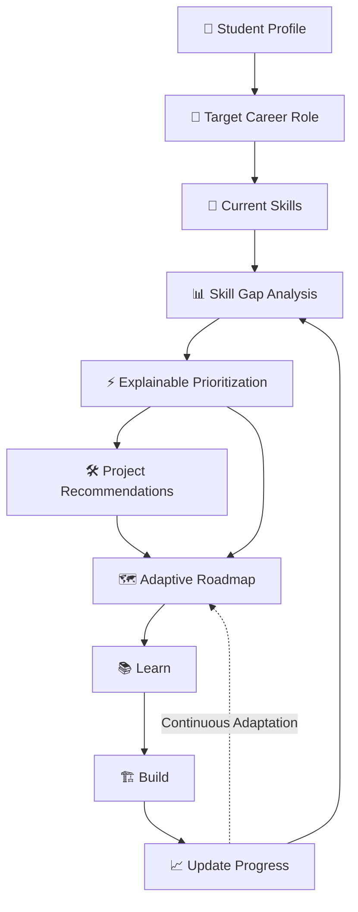
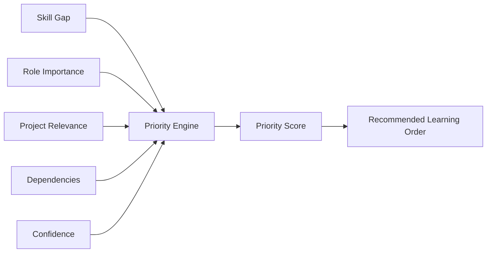
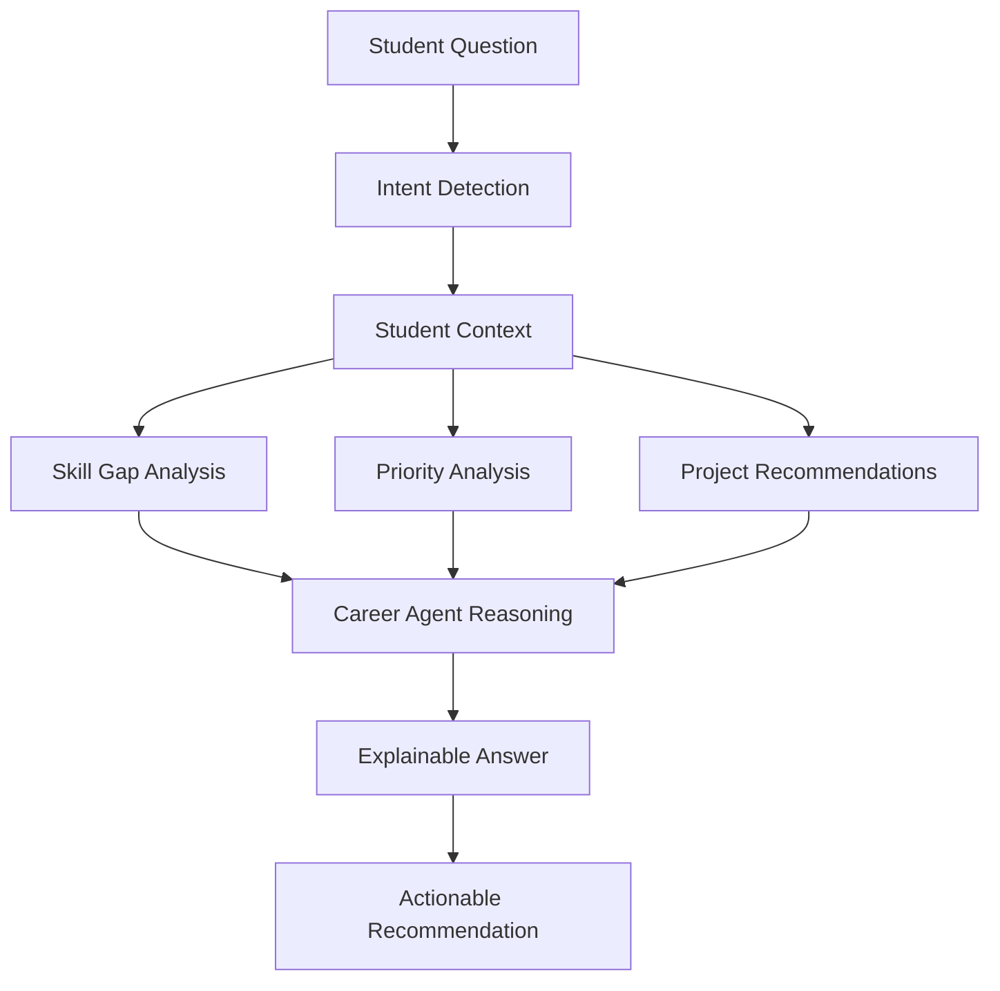
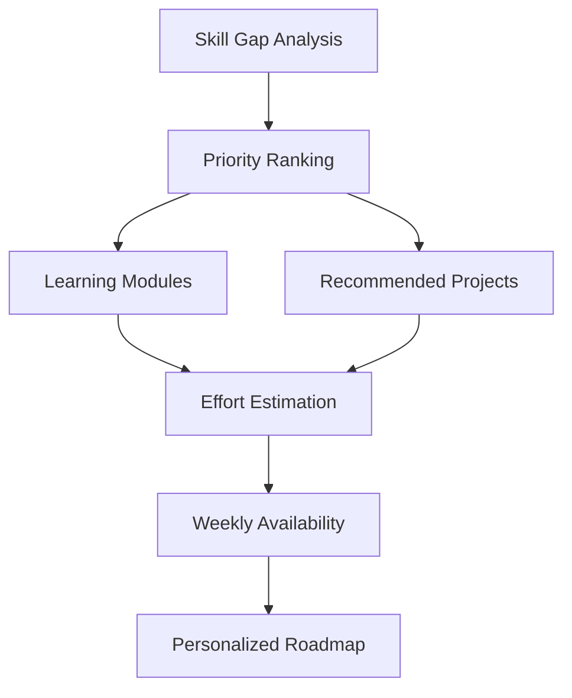
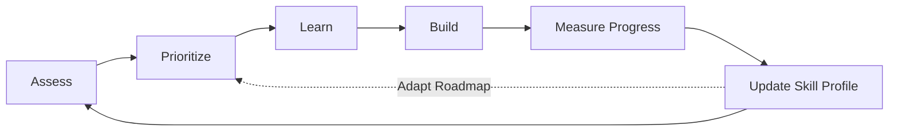
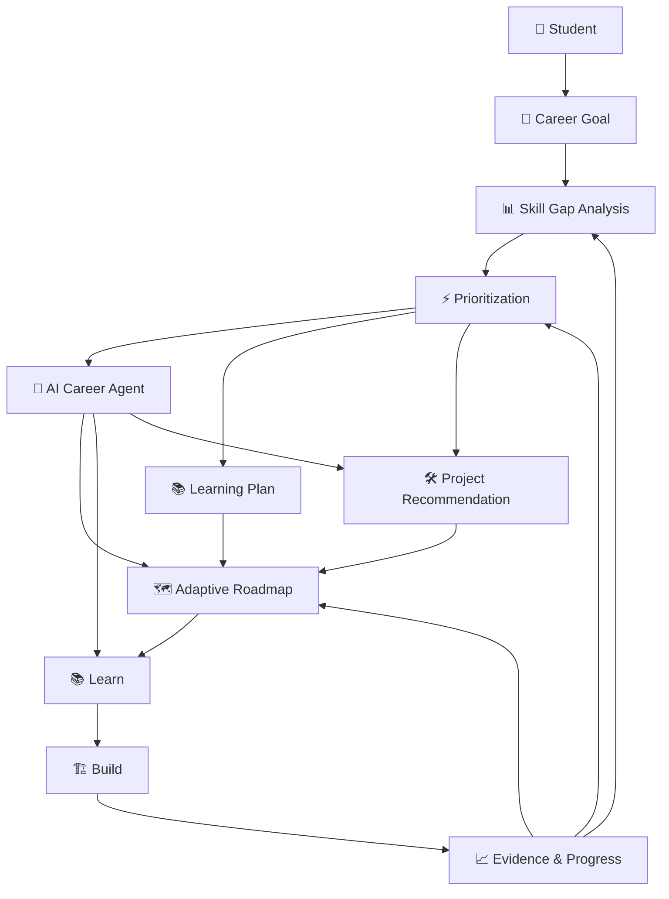
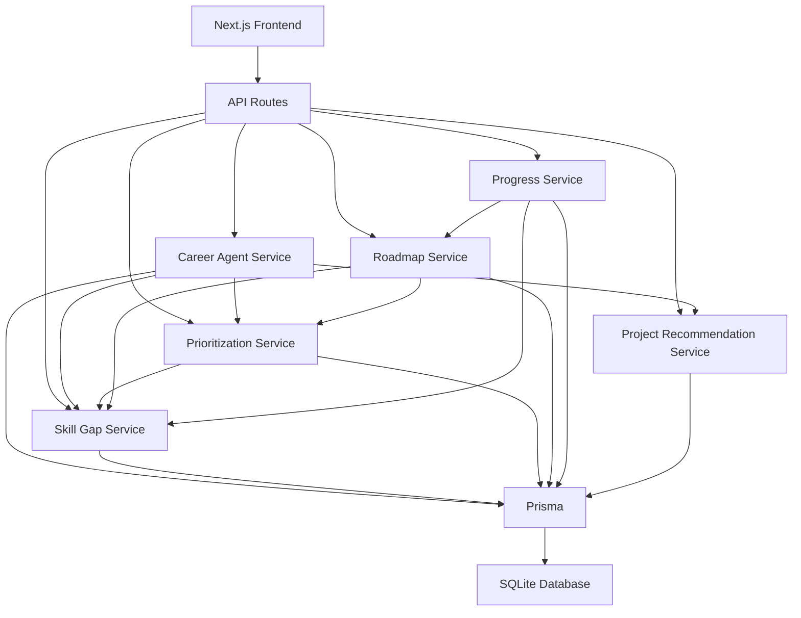
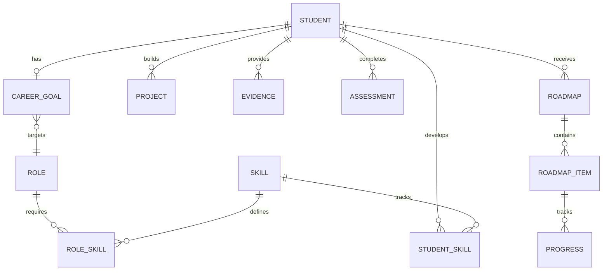
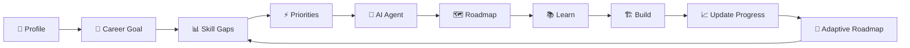

# GAPLY 🚀

### AI Career Agent for Skill-Gap Analysis, Personalized Learning & Adaptive Roadmaps

> **Predict your gaps. Prioritize your growth. Build your career.**

GAPLY is an AI-powered career development platform built for **PS 05 — Education & Employability: AI Skill-Gap & Personalized Learning Agent**.

It helps students move from a career goal to an actionable, measurable and continuously adapting learning path.

---

## 🎯 Problem

Students often know **what career they want**, but struggle to answer:

* What skills am I currently missing?
* Which skill should I learn first?
* Why is that skill important for my target role?
* What projects can demonstrate that skill?
* How should I plan my learning around my available time?
* What should change when my skills improve?

Most platforms provide static courses or generic roadmaps.

**GAPLY turns career planning into a continuous feedback loop.**

---

# 💡 Our Solution

GAPLY analyzes the student's:

* Profile
* Target career role
* Current skill proficiency
* Required role skills
* Skill gaps
* Role importance
* Project relevance
* Skill dependencies
* Assessment confidence
* Learning progress
* Available weekly hours

It then generates an **explainable and adaptive career roadmap**.



### Core Intelligence Loop

**Assess → Prioritize → Learn → Build → Adapt**

---

# ✨ Key Features

## 🎯 1. Career Goal Engine

Students define:

* Target career role
* Current experience level
* Available weekly hours
* Desired timeline

GAPLY uses this information to personalize the entire learning journey.

---

## 📊 2. Skill-Gap Analysis

GAPLY compares the student's current proficiency with the required proficiency for the selected career role.

Example:

```text
JavaScript
Current:   68
Required:  85
Gap:       -17
```

The system identifies whether a skill is:

* 🟢 Low gap
* 🟡 Medium gap
* 🔴 High gap

and uses the results to determine what needs attention.

---

## ⚡ 3. Explainable Skill Prioritization

GAPLY doesn't simply say:

> "Learn Node.js."

It explains **why Node.js should be prioritized**.

Priority is calculated using factors including:

* Skill Gap
* Role Importance
* Project Relevance
* Skill Dependencies
* Assessment Confidence



This makes the recommendation **transparent and actionable**.

---

# 🤖 4. AI Career Agent

The AI Career Agent acts as an interactive career assistant.

Students can ask questions such as:

```text
Why should I focus on Node.js?

What should I learn this week?

What skills am I missing for Full Stack Development?

What project should I build next?

What should I focus on after improving System Design?
```

The agent uses structured student data, skill gaps, priorities, projects and progress to generate contextual recommendations.



### Example

```text
Student:
"Why should I focus on System Design?"

GAPLY:
System Design is currently 55/100 while your target role
requires 65/100.

That creates a 10-point gap.

It is prioritized based on:
• role requirement
• gap size
• project relevance
• dependencies
• confidence in the current assessment
```

---

# 🗺️ 5. Adaptive Roadmap

GAPLY generates a roadmap based on:

* Skill priorities
* Skill dependencies
* Available weekly hours
* Career timeline
* Recommended projects

The roadmap includes:

* Learning modules
* Practical projects
* Estimated effort
* Dependencies
* Weekly schedule



---

# 🔄 6. Progress-Driven Adaptation

The roadmap isn't static.

When the student improves a skill, GAPLY recalculates the student's skill gap and updates the learning plan.

### Example

```text
Before

System Design
55 / 65
Gap: -10


        ↓

Student learns and updates progress


        ↓

After

System Design
62 / 65
Gap: -3


        ↓

GAPLY recalculates priorities
and adapts the roadmap
```

This creates a continuous learning loop:



---

# 🛠️ 7. Project Recommendations

Learning a skill is not enough.

Students also need **evidence** that they can apply it.

GAPLY recommends projects based on:

* Current skill gaps
* Target role
* Skill relevance
* Portfolio value
* Estimated effort

Example projects include:

* Full Stack Task Manager
* E-Commerce Platform
* Real-Time Collaboration App
* Developer Portfolio
* REST API Service

The roadmap connects **learning → building → demonstrating skills**.

---

# 🧠 Complete GAPLY Intelligence



---

# 🏗️ Technical Architecture



---

# 🧩 Data Model



---

# 💻 Technology Stack

### Frontend

* Next.js 16
* React 18
* TypeScript
* Tailwind CSS

### Backend

* Next.js API Routes
* TypeScript
* Service-based architecture

### Database

* SQLite
* Prisma ORM
* `@prisma/adapter-better-sqlite3`
* `better-sqlite3`

### Intelligence Layer

* Skill-gap analysis
* Weighted skill prioritization
* Explainable recommendations
* Career Agent reasoning
* Adaptive roadmap generation
* Progress-driven recalculation

---

# 📂 Project Structure

```text
gaply-bnb/
│
├── prisma/
│   ├── schema.prisma
│   └── seed.ts
│
├── src/
│   ├── app/
│   │   ├── api/
│   │   │   ├── agent/
│   │   │   ├── career-goal/
│   │   │   ├── projects/
│   │   │   ├── progress/
│   │   │   ├── roadmap/
│   │   │   └── skills/
│   │   │
│   │   └── (dashboard)/
│   │       └── dashboard/
│   │           ├── agent/
│   │           ├── career-goal/
│   │           ├── profile/
│   │           ├── projects/
│   │           ├── roadmap/
│   │           └── skills/
│   │
│   └── lib/
│       └── services/
│           ├── aiService.ts
│           ├── careerAgentService.ts
│           ├── prioritizationService.ts
│           ├── progressService.ts
│           ├── projectRecommendationService.ts
│           ├── roadmapService.ts
│           └── skillGapService.ts
│
├── next.config.ts
├── package.json
└── README.md
```

---

# 🔌 API Routes

| Route              | Purpose                                 |
| ------------------ | --------------------------------------- |
| `/api/agent`       | AI Career Agent interactions            |
| `/api/skills`      | Skill-gap analysis and prioritization   |
| `/api/progress`    | Update student skill progress           |
| `/api/roadmap`     | Generate and retrieve adaptive roadmaps |
| `/api/projects`    | Project recommendations                 |
| `/api/career-goal` | Career goal management                  |

---

# 🔬 How GAPLY Prioritizes Skills

GAPLY combines multiple signals instead of relying only on the size of the skill gap.

```text
Priority Score

    ↓

Skill Gap
    +
Role Importance
    +
Project Relevance
    +
Dependencies
    +
Assessment Confidence

    ↓

Priority Ranking

    ↓

Learning Order
```

This allows the system to answer:

> **“What should I work on next, and why?”**

rather than simply:

> **“What skills do I need?”**

---

# 🧪 Hackathon Demo

The recommended demonstration flow is:



### Demo Scenario

**Target Role:** Full Stack Developer

**Timeline:** 6 months

**Availability:** 15 hours/week

The demo shows:

1. Student profile
2. Career goal selection
3. Skill-gap analysis
4. Explainable prioritization
5. AI Career Agent
6. Project recommendations
7. Personalized weekly roadmap
8. Skill progress update
9. Automatic roadmap adaptation

---

# 🏆 Hackathon Alignment

GAPLY directly addresses the challenge of building an **AI Skill-Gap & Personalized Learning Agent**.

### Problem Relevance

Converts a student's career goal into measurable skill requirements.

### Innovation

Combines skill-gap analysis, explainable prioritization, project recommendations and adaptive planning.

### Technical Implementation

Uses a service-oriented architecture with Prisma, SQLite, structured reasoning and dynamic roadmap generation.

### Practicality

Students receive actionable learning priorities instead of generic course lists.

### User Experience

A single dashboard connects profile, career goals, skills, AI guidance, projects and roadmap.

### Adaptability

Student progress feeds back into the system and influences future recommendations.

---

# 🔐 Data & Design Principles

GAPLY is designed around:

* Explainable recommendations
* Structured student data
* Progress-based adaptation
* Human-in-the-loop decisions
* Transparent skill requirements
* No fabricated learning resources
* Clear separation between current proficiency and required proficiency

The system provides recommendations while keeping the student in control of their learning decisions.

---

# 🚀 Getting Started

## 1. Clone the repository

```bash
git clone https://github.com/itsdivyanshuno/gaply-bnb-2026.git
cd gaply-bnb
```

## 2. Install dependencies

```bash
npm install
```

## 3. Configure environment variables

Create `.env`:

```env
DATABASE_URL="file:./dev.db"
```

## 4. Generate Prisma Client

```bash
npx prisma generate
```

## 5. Seed the database

```bash
npx tsx prisma/seed.ts
```

## 6. Start development server

```bash
npm run dev
```

Open:

```text
http://localhost:3000
```

---

# 🧪 Production Build Check

Before submitting the project:

```bash
npm run build
```

The application should complete the Next.js production build successfully.

---

# 📑 Hackathon Presentation

### GAPLY — Bit N Build '26

**Presentation:**
[View GAPLY Hackathon Presentation](https://docs.google.com/presentation/d/1RqMjsQCQxUgrOf95PitRNWezacG7awyr4jJdRnLJoyQ/edit?usp=sharing)

> Make sure the Google Slides sharing permission is set to **Anyone with the link → Viewer** before submission.

---

# 💻 GitHub

**Repository:**
https://github.com/itsdivyanshuno/gaply-bnb-2026

---

# 🎥 Demo Flow

```text
Profile
   ↓
Career Goal
   ↓
Skill Gap Analysis
   ↓
Explainable Prioritization
   ↓
AI Career Agent
   ↓
Project Recommendation
   ↓
Adaptive Roadmap
   ↓
Learn
   ↓
Build
   ↓
Update Progress
   ↓
Recalculate
   ↓
Adapt
   ↺
```

---

# 🌟 Vision

GAPLY aims to move career preparation from:

```text
"Tell me what to learn."
```

to:

```text
"Understand where I am,
understand where I want to go,
tell me what is missing,
explain what matters most,
give me a path,
and adapt that path as I improve."
```

---

# 👨‍💻 Team

### Team TechBrigade


**Divyansh Shukla**
B.Tech Information Technology
HBTU Kanpur

---

## GAPLY 🚀

### **Assess. Prioritize. Learn. Build. Adapt.**

> **Turn your career goal into your next actionable step.**
