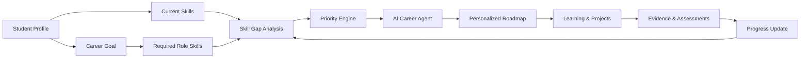
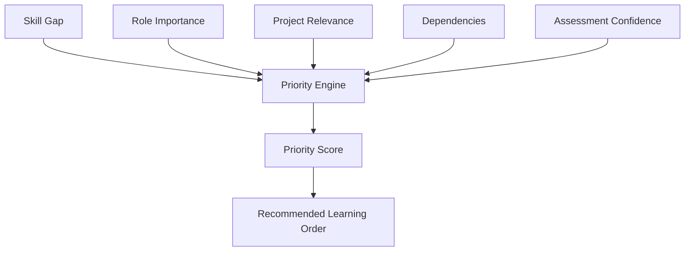
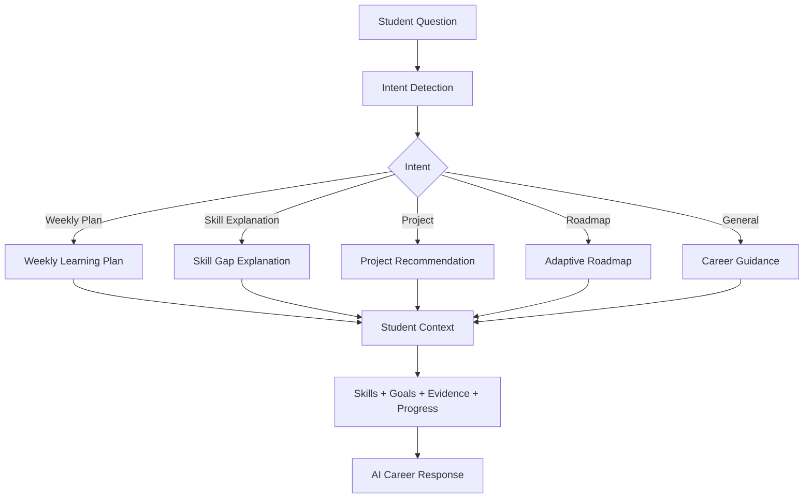
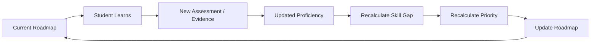
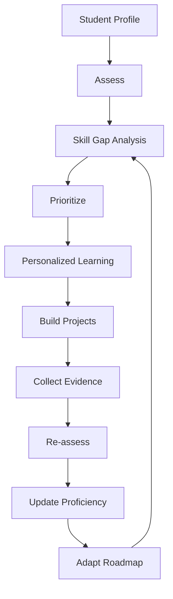
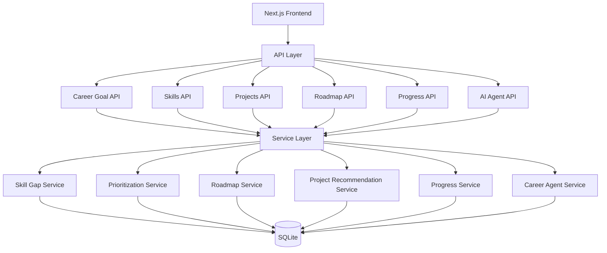
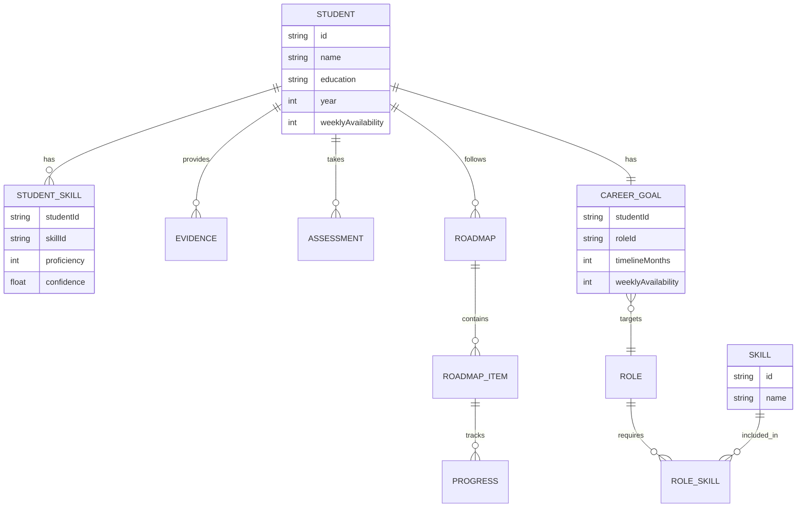

# TechBrigade - proposed GAPLY 🚀

### AI Career Agent for Skill-Gap Analysis, Personalized Learning & Adaptive Roadmaps

> **Predict your gaps. Prioritize your growth. Build your career.**

---

## 🎥 Hackathon Demo

[▶️ Watch BnB Hackathon Demo Video](https://drive.google.com/file/d/17PSALmUefXzFY2dJtnXcrYB79sltD_-1/view?usp=sharing)

## 📑 Hackathon Presentation

[📊 View BnB Hackathon PPT](https://docs.google.com/presentation/d/1RqMjsQCQxUgrOf95PitRNWezacG7awyr4jJdRnLJoyQ/edit?usp=sharing)

---

# 🎯 Problem Statement

### PS 05 — Education & Employability: AI Skill-Gap & Personalized Learning Agent

Students often know the career role they want but struggle to understand:

* What skills they are missing
* How large each skill gap is
* Which skills they should learn first
* Which projects can demonstrate those skills
* How to create a realistic learning roadmap
* How their roadmap should change as they improve

Traditional learning platforms provide courses, but they often do not continuously reason about the student's **current capability, target role, evidence, progress, and priorities together**.

---

# 💡 Our Solution — GAPLY

**GAPLY** is an AI-powered career agent that continuously converts a student's:

**Profile + Skills + Evidence + Progress + Career Goal**

into an **explainable and adaptive career roadmap**.

Instead of simply telling students *what to learn*, GAPLY answers:

> **What should I learn next, why does it matter, and what should I build to prove it?**

### 🧠 Core Intelligence Loop

```text
Assess
   ↓
Prioritize
   ↓
Learn
   ↓
Build
   ↓
Adapt
   ↺
```

As the student's proficiency changes, GAPLY recalculates the skill gaps, priorities and roadmap.

---

# 🔄 How GAPLY Works



### The system continuously answers:

**What is missing? → What matters most? → What should I do next? → How do I prove it? → What changed?**

---

# ✨ Key Features

## 1. 🎯 Career Goal Engine

Students select their desired career role and define:

* Target role
* Current level
* Timeline
* Weekly availability

GAPLY uses this information to personalize the entire learning journey.

---

## 2. 📊 Skill-Gap Analysis

GAPLY compares the student's current proficiency against the required proficiency for the target role.

```text
Current Proficiency
        ↓
Role Requirement
        ↓
Skill Gap
        ↓
Readiness
```

Example:

```text
Node.js

Current:   50
Required:  80

Gap:       -30
Status:    HIGH
```

The system identifies which skills are already sufficient and which require improvement.

---

## 3. 🧠 Explainable Skill Prioritization

Not every skill gap has the same importance.

GAPLY calculates a weighted priority score using factors such as:

* Gap size
* Role importance
* Project relevance
* Skill dependencies
* Confidence in assessment



This allows GAPLY to explain:

> **Why should I focus on this skill now?**

rather than simply displaying a list of skills.

---

# 🤖 AI Career Agent

GAPLY includes a conversational career agent that works with the student's real profile and progress.

The agent can answer questions such as:

```text
"What should I learn this week?"

"Why should I focus on Node.js?"

"What project should I build next?"

"Explain my biggest skill gap."

"How can I improve my readiness?"

"What should I focus on for my target role?"
```

The agent uses structured student data, skill-gap analysis, prioritization and project recommendations to generate contextual responses.

---

# 🧩 AI Agent Flow



---

# 🗺️ Adaptive Roadmap

GAPLY does not create a fixed roadmap and forget about it.

The roadmap adapts when the student's skills change.



### Example

If a student's System Design proficiency changes:

```text
Before

System Design
55 / 65

Gap = -10
```

After learning:

```text
System Design
62 / 65

Gap = -3
```

GAPLY recognizes the improvement and recalculates the learning priorities instead of keeping the old plan unchanged.

---

# 📚 Personalized Weekly Planning

GAPLY considers the student's available learning time.

For example:

```text
Weekly Availability: 15 hours
```

The system distributes learning modules and projects across the available time.

Example:

```text
Week 1
├── JavaScript       9 hrs
└── Node.js          6 hrs

Week 2
├── Node.js          9 hrs
└── REST APIs        6 hrs

Week 3
├── REST APIs       10 hrs
└── PostgreSQL       5 hrs
```

This converts a large career goal into manageable weekly actions.

---

# 🛠️ Project Recommendations

Learning alone is not enough.

Students need **evidence** that they can apply their skills.

GAPLY recommends projects based on:

* Skill gaps
* Target role
* Required technologies
* Current proficiency
* Portfolio relevance

Example:

```text
Skill Gap
    ↓
Required Capability
    ↓
Project Recommendation
    ↓
Build
    ↓
Evidence
    ↓
Re-assessment
```

This creates a connection between:

**Learning → Building → Evidence → Career Readiness**

---

# 🔁 Complete Intelligence Loop



### GAPLY is built around this continuous loop:

> **Assess → Prioritize → Learn → Build → Adapt**

---

# 🏗️ Technical Architecture



---

# ⚙️ Technology Stack

### Frontend

* Next.js 16
* React
* TypeScript
* Tailwind CSS

### Backend

* Next.js API Routes
* TypeScript
* Service-based architecture

### Database

* SQLite
* Prisma ORM
* `@prisma/adapter-better-sqlite3`
* `better-sqlite3`

### AI / Intelligence

* AI-assisted career reasoning
* Structured skill-gap analysis
* Explainable prioritization
* Context-aware career agent
* Adaptive roadmap generation

---

# 📂 Project Structure

```text
gaply-bnb-2026/
│
├── prisma/
│   ├── schema.prisma
│   └── seed.ts
│
├── src/
│   ├── app/
│   │   ├── api/
│   │   │   ├── agent/
│   │   │   ├── career-goal/
│   │   │   ├── projects/
│   │   │   ├── progress/
│   │   │   ├── roadmap/
│   │   │   └── skills/
│   │   │
│   │   └── (dashboard)/
│   │       └── dashboard/
│   │           ├── agent/
│   │           ├── career-goal/
│   │           ├── profile/
│   │           ├── projects/
│   │           ├── roadmap/
│   │           └── skills/
│   │
│   └── lib/
│       └── services/
│           ├── aiService.ts
│           ├── careerAgentService.ts
│           ├── prioritizationService.ts
│           ├── progressService.ts
│           ├── projectRecommendationService.ts
│           ├── roadmapService.ts
│           └── skillGapService.ts
│
├── next.config.ts
├── package.json
└── README.md
```

---

# 🔌 API Layer

| Endpoint           | Purpose                         |
| ------------------ | ------------------------------- |
| `/api/career-goal` | Career goal management          |
| `/api/skills`      | Skill-gap analysis & priorities |
| `/api/projects`    | Project recommendations         |
| `/api/roadmap`     | Personalized roadmap            |
| `/api/progress`    | Skill progress updates          |
| `/api/agent`       | AI Career Agent                 |

---

# 🗃️ Data Model



---

# 🎬 Recommended Hackathon Demo Flow

The application is designed around a clear judge-friendly demo:

```text
1. Profile
      ↓
2. Select Target Career
      ↓
3. View Skill Gaps
      ↓
4. See Explainable Priorities
      ↓
5. Ask AI Career Agent
      ↓
6. Get Personalized Plan
      ↓
7. Get Project Recommendation
      ↓
8. Update Skill Progress
      ↓
9. Roadmap Automatically Adapts
      ↓
10. Re-assess Readiness
```

---

# 🏆 Hackathon Alignment

GAPLY directly addresses the core requirements of **PS 05 — AI Skill-Gap & Personalized Learning Agent**.

| Requirement           | GAPLY Implementation                 |
| --------------------- | ------------------------------------ |
| Student Profile       | Profile & career context             |
| Target Career         | Career Goal Engine                   |
| Skill Gap             | Skill-Gap Analysis                   |
| Prioritization        | Explainable Priority Engine          |
| Personalized Learning | Adaptive Roadmap                     |
| AI Guidance           | AI Career Agent                      |
| Practical Application | Project Recommendations              |
| Progress Tracking     | Assessments & Evidence               |
| Adaptation            | Progress-driven roadmap updates      |
| Explainability        | "Why this recommendation?" reasoning |

---

# 💥 What Makes GAPLY Different

GAPLY is not just:

* ❌ A course recommendation system
* ❌ A static roadmap generator
* ❌ A resume analyzer
* ❌ A chatbot giving generic career advice

Instead, GAPLY connects:

```text
Career Goal
     ↓
Required Skills
     ↓
Current Skills
     ↓
Skill Gap
     ↓
Priority
     ↓
Learning Plan
     ↓
Projects
     ↓
Evidence
     ↓
Progress
     ↓
Adaptive Roadmap
```

The goal is to create a **continuous career intelligence loop** rather than a one-time recommendation.

---

# 🚀 Getting Started

## 1. Clone the repository

```bash
git clone https://github.com/itsdivyanshuno/gaply-bnb-2026.git
cd gaply-bnb-2026
```

## 2. Install dependencies

```bash
npm install
```

## 3. Configure environment

Create `.env`:

```env
DATABASE_URL="file:./dev.db"
```

## 4. Generate Prisma Client

```bash
npx prisma generate
```

## 5. Seed the database

```bash
npx prisma db seed
```

## 6. Start development server

```bash
npm run dev
```

Then open:

```text
http://localhost:3000
```

---

# 🧪 Build Verification

Run:

```bash
npm run build
```

The project uses Next.js production build verification to catch:

* TypeScript errors
* API issues
* Route errors
* Production compilation problems

---

# 📈 Future Scope

GAPLY can be extended with:

* Real-time labor market skill requirements
* Resume-to-skill extraction
* GitHub project analysis
* Automated project evaluation
* Coding assessment integration
* Learning-resource recommendations
* Industry-specific role profiles
* More advanced LLM reasoning
* Mentor / human-in-the-loop feedback
* Internship and job readiness signals

---

# 🎯 Vision

The long-term vision of GAPLY is to become a **personal career intelligence layer** for students.

Instead of asking:

> **"What should I learn?"**

Students can ask:

> **"What is the next best action for my career, and why?"**

GAPLY continuously uses the student's goals, skills, evidence and progress to answer that question.

---

# 👨‍💻 Team

## Team TechBrigade

**B.Tech Information Technology — 2nd Year**
**Harcourt Butler Technical University (HBTU), Kanpur**

| Name                  | Role           |
| --------------------- | -------------- |
| **Divyansh Shukla**   | 👑 Team Leader |
| **Shruti Singh**      | Team Member    |
| **Anurag Kumar**      | Team Member    |
| **Tanish Srivastava** | Team Member    |

---

# 🔗 Project Links

### 💻 GitHub

[View BnB Hackathon on GitHub](https://github.com/itsdivyanshuno/gaply-bnb-2026.git)

### 📑 Hackathon Presentation

[View BnB Hackathon PPT](https://docs.google.com/presentation/d/1RqMjsQCQxUgrOf95PitRNWezacG7awyr4jJdRnLJoyQ/edit?usp=sharing)

### 🎥 Hackathon Demo

[Watch BnB Hackathon Demo Video](https://drive.google.com/file/d/17PSALmUefXzFY2dJtnXcrYB79sltD_-1/view?usp=sharing)

---

# 🚀 GAPLY

### **Assess. Prioritize. Learn. Build. Adapt.**

> **Turn your career goal into your next actionable step.**
